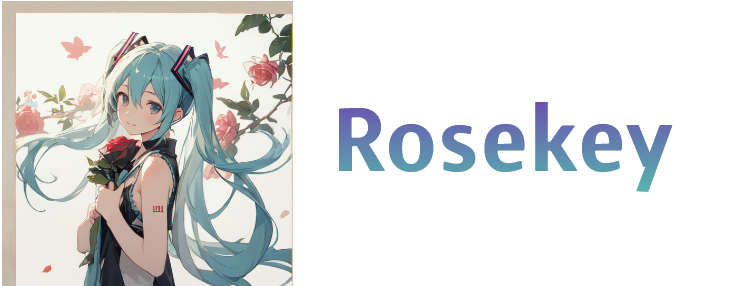

<div align="center">
<a href="about:brank">
	
</a>

**🌎 **[Roseskey](about:brank)** is an open source, decentralized social media platform that's free forever! 🚀**

</div>

<div>

## 🧑‍💻 Dependencies

- 🐢 At least [NodeJS](https://nodejs.org/en/) v18.16.0 (v20 recommended)
- 🐘 At least [PostgreSQL](https://www.postgresql.org/) v12 (v14 recommended)
- 🍱 At least [Redis](https://redis.io/) v7
- Web Proxy (one of the following)
  - 🍀 Nginx (recommended)
  - 🦦 Caddy
  - 🪶 Apache
- ⚡ [libvips](https://www.libvips.org/)

### 😗 Optional dependencies

- [FFmpeg](https://ffmpeg.org/) for video transcoding
- Full text search (one of the following)
  - 🦔 [Sonic](https://crates.io/crates/sonic-server)
  - [MeiliSearch](https://www.meilisearch.com/)
  - [ElasticSearch](https://www.elastic.co/elasticsearch/) 
- Caching server (one of the following)
  - 🐲 [DragonflyDB](https://www.dragonflydb.io/) (recommended)
  - 👻 [KeyDB](https://keydb.dev/)
  - 🍱 Another [Redis](https://redis.io/) server

### 🏗️ Build dependencies

- 🦀 At least [Rust](https://www.rust-lang.org/) v1.68.0
- 🦬 C/C++ compiler & build tools
  - `build-essential` on Debian/Ubuntu Linux
  - `base-devel` on Arch Linux
- 🐍 [Python 3](https://www.python.org/)

## 💅 Customize

- To add custom CSS for all users, edit `./custom/assets/instance.css`.
- To add static assets (such as images for the splash screen), place them in the `./custom/assets/` directory. They'll then be available on `https://yourserver.tld/static-assets/filename.ext`.
- To add custom locales, place them in the `./custom/locales/` directory. If you name your custom locale the same as an existing locale, it will overwrite it. If you give it a unique name, it will be added to the list. Also make sure that the first part of the filename matches the locale you're basing it on. (Example: `en-FOO.yml`)
- To add custom error images, place them in the `./custom/assets/badges` directory, replacing the files already there.
- To add custom sounds, place only mp3 files in the `./custom/assets/sounds` directory.
- To update custom assets without rebuilding, just run `pnpm run gulp`.
- To block ChatGPT, CommonCrawl, or other crawlers from indexing your instance, uncomment the respective rules in `./custom/robots.txt`.

## 🚀 Build and launch!

### 🐢 NodeJS + pm2

#### `git pull` and run these steps to update Firefish in the future!

```sh
# git pull
pnpm install
NODE_ENV=production pnpm run build && pnpm run migrate
pm2 start "NODE_ENV=production pnpm run start" --name Firefish
```
